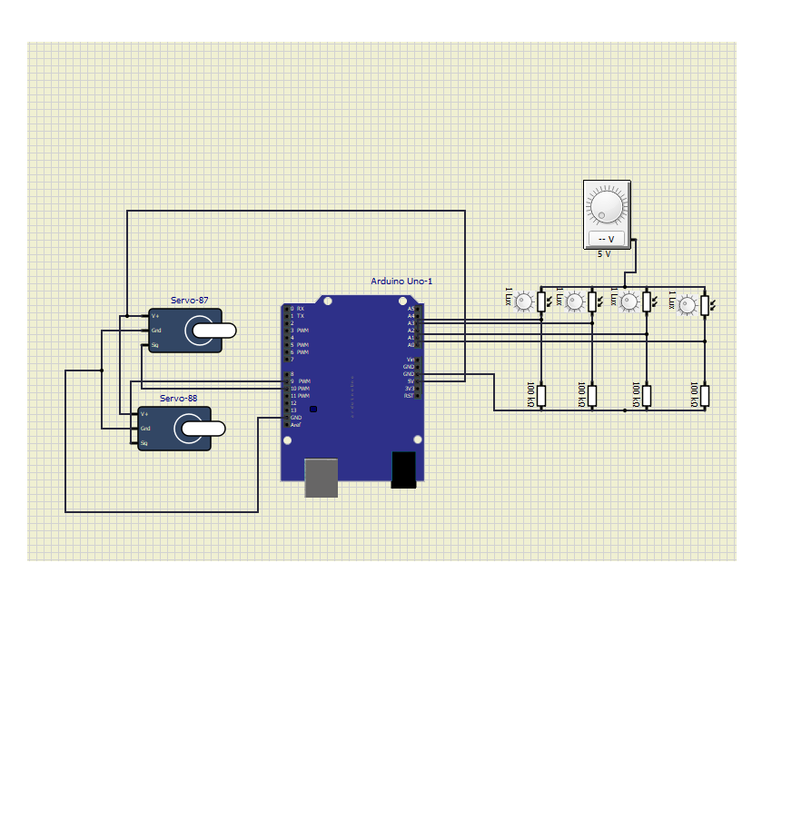
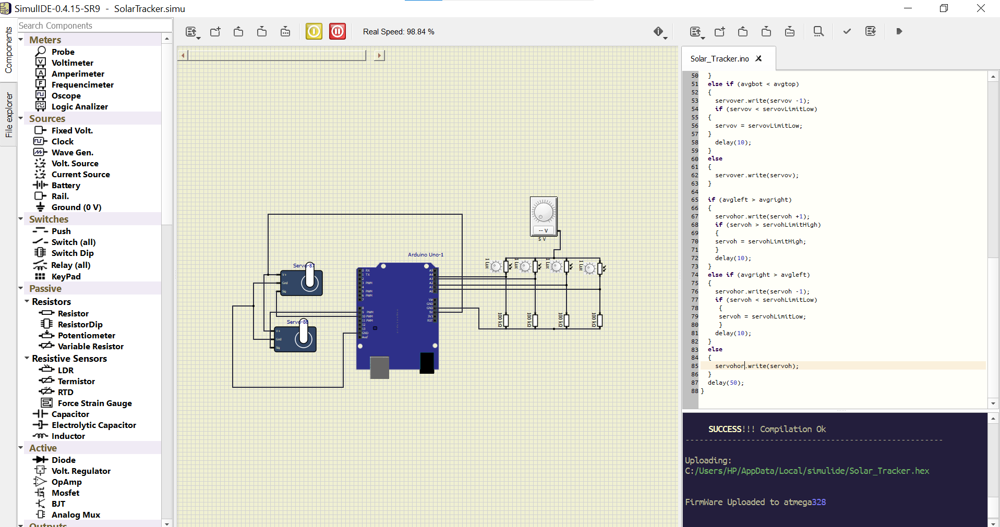

# Table of Contents
1. Abstract
2. Requirements
3. SWOT Analysis
4. 4W's and 1H
5. Circuit Diagram
6. Test Plan
7.  Components
8.  Applications
9.  Output

# Abstract
Solar Tracker using Arduino uno

Solar tracker, a system that positions an object at an angle relative to the Sun. The most-common applications for solar trackers are positioning photovoltaic (PV) panels (solar panels) so that they remain perpendicular to the Sun's rays and positioning space telescopes so that they can determine the Sun's direction.

In modern solar tracking systems, the solar panels are fixed on a structure that moves according to the position of the sun.

In this project the focus is on the implementation of solar tracker using ldr sensors, arduino uno and servo motor.

LDRs are used as the main light sensors. Two servo motors are fixed to the structure that holds the solar panel. The program for Arduino is uploaded to the microcontroller.

LDRs sense the amount of sunlight falling on them. Four LDRs are divided into top, bottom, left and right.

For east – west tracking, the analog values from two top LDRs and two bottom LDRs are compared and if the top set of LDRs receive more light, the vertical servo will move in that direction. If the bottom LDRs receive more light, the servo moves in that direction.

For angular deflection of the solar panel, the analog values from two left LDRs and two right LDRs are compared. If the left set of LDRs receive more light than the right set, the horizontal servo will move in that direction.

If the right set of LDRs receive more light, the servo moves in that direction.

# Requirements

High Level Requirements

|  ID|Description|Status|
  |---|---|---|
  | HR01 | Movement of solar panel according to the position of the sun| To be Done|
  | HR02 | Comparison of the analog values recevied on both right and left side ldr|To be Done|
  | HR03 | According to  the more light the servo motor moves in that direction|To be Done|
  
  
Low Level Requirements

 |  ID|Description|Status|
  |---|---|---|
  | LR01 | LDRs used as main light sensors |To be Done|
  | LR02 | Arduino uno | To be Done|
  | LR03 | Servo motors for movement|To be Done|
  | LR04 | 100k resistors|To be Done|
  
  
  # SWOT ANALYSIS
  Strength  Solar tracker positions an object at an angle relative to the sun. It tracks the sun east to west,rotating on a single point,moving either in unison,panel or by section.

Weakness Requires more maintenance and are slightly more expensive.

Opportunities This tracker not only tracks the sun as it moves east to west,buit also follows it as it moves from north to south.

# 4W 1H

4W 1H What - Solar Tracker

Where - Solar trackers are typically used for ground-mounted solar panels and large, free-standing solar installations like solar trees.

When - Solar tracker help maximize solar production by following the sun throughout the day.

Why - solar tracker, a system that positions an object at an angle relative to the Sun. Solar trackers generate more electricity than their stationary counterparts due to an increased direct exposure to solar rays.

How - LDRs are used as main light sensors.Two servo motors are fixed to the structure that holds the solar panel. Ldr sense the amount of light falling on them.For east-west tracking , the analog values from two top LDRs and bottom two LDRs are compared and if the top set of LDRs receive more light, the vertical servo will move in that direction.

# Circuit Diagram

# Test Plan

# High Level Test Plan

|  ID|Requirement|Status|
  |---|---|---|
  | 01 | Movement of Servo motor| Pass |
  | 02 | Comparison of the analog values recevied on both right and left side ldr| Pass|
  | 03 | According to  the more light the servo motor moves in that direction| Pass|
  
  
  # Low Level Test Plan
  
  |  ID|Requirement|Status|
  |---|---|---|
  | 01.1 | Ldr used as main light sensors| Pass |
  | 01.2 |Ldr Which reveives more light servo motor moves in that direction | Pass|
  
  
  # Components
  
  Arduino uno- Arduino  Uno is a microcontroller board based on the ATmega328P (datasheet). It has 14 digital input/output pins (of which 6 can be used as PWM outputs), 6 analog inputs, a 16 MHz quartz crystal, a USB connection, a power jack, an ICSP header and a reset button. 

Servo motor (Actuator)- The function of the servo motor is to convert the control signal of the controller into the rotational angular displacement or angular velocity of the motor output shaft.

LDR (Sensor)- An LDR is a component that has a (variable) resistance that changes with the light intensity that falls upon it. This allows them to be used in light sensing circuits. Light Dependent Resistors (LDR) are also called photoresistors. They are made of high resistance semiconductor material.

Resistors-A resistor is a passive two-terminal electrical component that implements electrical resistance as a circuit element.

Solar Panel(Assumed)- In the above simulation circuit, We have assumed the solar panel is connected to the servo motors. The movement of servo motor indicate the movement of solar panel.Hence The implementation and execution of solar tracker completes on the movement of servo motor.

# Application

Solar trackers are devices used to orient photovoltaic panels, reflectors, lenses or other optical devices toward the sun. Since the sun's position in the sky changes with the seasons and the time of day, trackers are used to align the collection system to maximize energy production.

# Output

 
  
 

